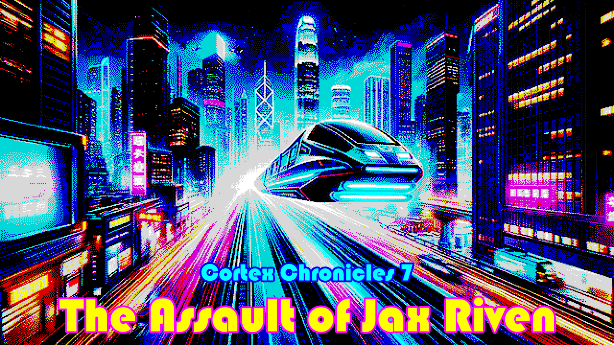

# THE CORTEX CHRONICLES, CHAPTER 7 - The Assault of Jax Riven

Developed for the Game Creator's Club at Lusofona University.
This month, the theme is Trains

This is a part of what I hope will be "The Cortex Chronicles" - I want all the games I do for the Game Creator's Club this year to be linked together, hence this idea.
I also want to use a different engine on every entry, so let's see how that goes! :)

This time, I'm using [GameMaker]. I've used in the the past, many years ago, but it sure looks like it has changed a lot!
I'm going to use code, since I prefer to program than using visual tools.

## Game

In this game, you play as Jax Riven, a former D-Boy turned freedom fighter. In the previous game, our heroes infiltrated the research lab of Doctor Cogwell and exposed
some weaknesses on the Prime Nexus. Now, they need a tactical nuclear warhead for their plans, and will have to use an armored hovertrain to steal it!

## Art

- Everything done by Diogo de Andrade, licensed through the [CC0] license.

## Sound

- Nuclear explosion by [unfa], licensed through the [CC0] license.
- Shot by [pgi], licensed through the [CC0] license.
- Thump by [TechGeekMusic], licensed through the [CC0] license.
- Ricochet by [cedarstudios], licensed through the [CC0] license.
- Explosions by [Anomaex] / [magnuswaker] / [JuveriSetila], licensed through the [CC0] license.
- Overheat sound by [Marregheriti], licensed through the [CC0] license.
- Gun cocking sound by [Cloud-10], licensed through the [CC0] license.
- Alarm sound by [jobro], licensed through the [CC0] license.
- Main game music by [Migfus20], licensed through the [CC0] license.
- Logo music by [João Camacho], licensed to Spellcaster Studios
- Title music by [awrmacd], licensed through the [CC0] license.

## Code

- Scrolling text code by [Musical Kittehs], licensed through the [CC0] license.
- All remaining game source code by Diogo de Andrade is licensed under the [MIT] license.

## Metadata

- Autor: [Diogo Andrade]git push

[Diogo Andrade]:https://github.com/DiogoDeAndrade
[CC0]:https://creativecommons.org/publicdomain/zero/1.0/
[CC-BY 3.0]:https://creativecommons.org/licenses/by/3.0/
[CC-BY-SA 4.0]:http://creativecommons.org/licenses/by-sa/4.0/
[MIT]:LICENSE
[GameMaker]:https://gamemaker.io/en
[Musical Kittehs]:https://www.youtube.com/watch?v=3QUwo4_g3uw
[unfa]:https://freesound.org/people/unfa/
[pgi]:https://freesound.org/people/pgi/
[TechGeekMusic]:https://freesound.org/people/TechGeekMusic/
[cedarstudios]:https://freesound.org/people/cedarstudios/
[Anomaex]:https://freesound.org/people/Anomaex/
[magnuswaker]:https://freesound.org/people/magnuswaker/
[JuveriSetila]:https://freesound.org/people/JuveriSetila/
[Migfus20]:https://freesound.org/people/Migfus20/
[awrmacd]:https://freesound.org/people/awrmacd/
[Marregheriti]:https://freesound.org/people/Marregheriti/
[Cloud-10]:https://freesound.org/people/Cloud-10/
[jobro]:https://freesound.org/people/jobro/